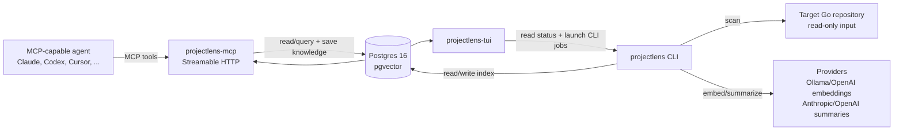
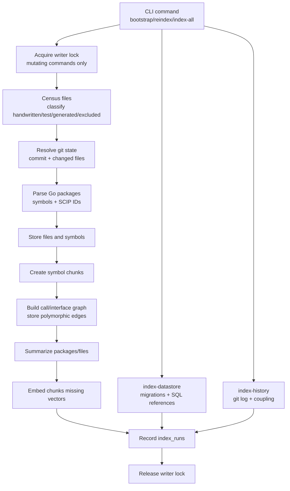
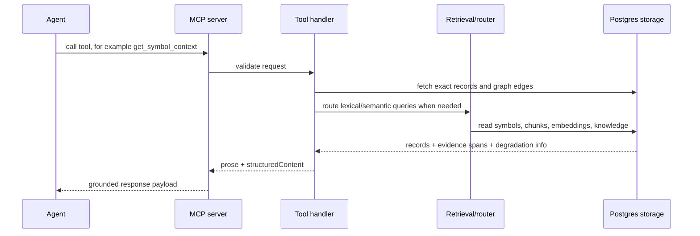

# ProjectLens Architecture

Last verified against: source tree on 2026-05-22 (`internal/mcpserver/tools.go`, `cmd/projectlens`, `internal/tui`).

Audience: first-time maintainers and agents who need to understand how ProjectLens fits together before changing it.

## System Context

ProjectLens is a local intelligence service for Go repositories. It indexes source code, datastore shape, git history, captured knowledge, summaries, and embeddings into Postgres, then exposes that state through a CLI, TUI, and MCP server.

## Runtime Components

| Component | Entry point | Role |
|---|---|---|
| CLI | `cmd/projectlens` | Builds and maintains the index, runs inspections, reports, exports, migrations, and knowledge maintenance commands. |
| MCP server | `cmd/projectlens-mcp` | Serves the indexed state to agents over Streamable HTTP at `/mcp`. |
| TUI | `cmd/projectlens-tui` | Operational dashboard for health, pipeline, storage, config, runs, and indexer job execution. |
| Postgres + pgvector | `docker/docker-compose.yml`, `migrations/` | Stores source facts, graph edges, history, chunks, embeddings, summaries, knowledge, index runs, and locks. |
| Target repo | configured by `--repo`, `REPO_PATH`, or config | Read-only source for census, parsing, datastore scan, and git history. |
| Providers | `internal/providers/*` | Embeddings and package summaries. Defaults are config-driven. |

## Data Layers

| Layer | Main tables | Producer | Consumer |
|---|---|---|---|
| Code | `files`, `symbols`, `chunks`, `edges` | `bootstrap`, `reindex`, `index-all` | MCP tools, CLI inspect/query/report/export |
| Datastore | `datastore_tables`, datastore edges | `index-datastore`, `index-all` | `get_table_context`, reports, graph export |
| History | `file_history`, `symbol_history`, coupling edges | `index-history`, `index-all` | `get_change_history`, `get_coupling`, reports |
| Docs and knowledge | `documents`, `knowledge_entries`, knowledge chunks/edges | `save_knowledge`; external docs ingestion is planned | `search_knowledge`, related-knowledge blocks, reports |
| Embeddings | `embeddings` | `index-embed`, `index-all`, `bootstrap`/`reindex` where applicable | semantic retrieval and knowledge search |
| Summaries | `summaries`, file heuristic summaries | `index-summarize`, code indexer | package context, reports, MCP responses |
| Runs and locks | `index_runs`, `index_locks` | all mutating indexer commands | `status`, `index_status`, TUI pipeline/jobs |

Edges carry two trust axes alongside the numeric `confidence` score:

- `provenance` — which producer wrote the edge (`parser`, `callgraph`, `sql_scanner`, `history`, `knowledge`, `docs`).
- `confidence_class` — graphify-style epistemic strength (`extracted`, `inferred`, `ambiguous`).

Both are CHECK-constrained. `projectlens report`, `projectlens export graph` (schema `projectlens-graph/v2`), and the three pilot MCP tools (`get_symbol_context`, `get_table_context`, `get_coupling`) surface them as per-hit fields and a top-level `Trust.worst_class` summary.

## Indexing Flow

## Query Flow

## Source Of Truth

Use these files before updating docs or behavior:

| Topic | Source |
|---|---|
| Make targets | `Makefile` |
| CLI subcommands and flags | `cmd/projectlens/*.go` |
| MCP tool list | `internal/mcpserver/tools.go` |
| TUI navigation keys | `internal/tui/app/keys.go` |
| TUI action keys | `internal/tui/jobs/registry.go` |
| Schema | `migrations/*.up.sql` |
| Edge trust vocabulary and writer rules | `docs/2026-05-22-confidence-and-provenance-design.md` |
| Agent setup | `agent/` and `docs/AGENT_SETUP.md` |

## Owner Docs

Each topic has one canonical home:

| Topic | Owning doc |
|---|---|
| Product overview and quick start | `README.md` |
| System shape and component map | `docs/architecture.md` |
| Commands, TUI, MCP usage, Docker, troubleshooting | `docs/operations.md` |
| Implementation pipeline, storage model, and internals | `docs/internals.md` |
| Agent wiring | `docs/AGENT_SETUP.md` |
| Maintainer conventions | `CLAUDE.md` |
| Historical plans | `docs/plans/` |
