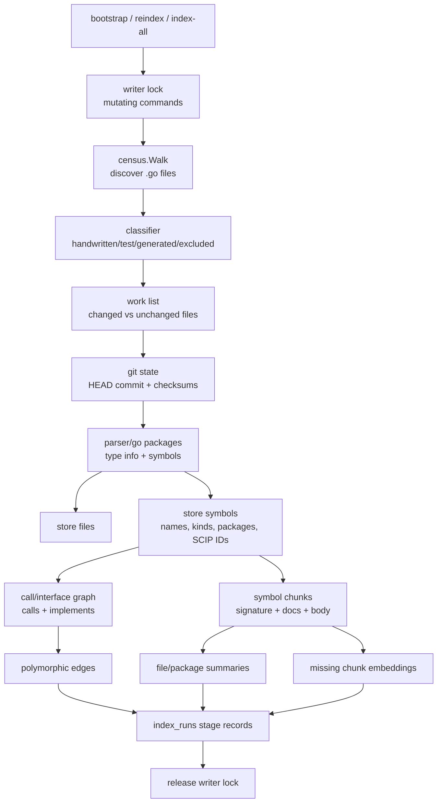
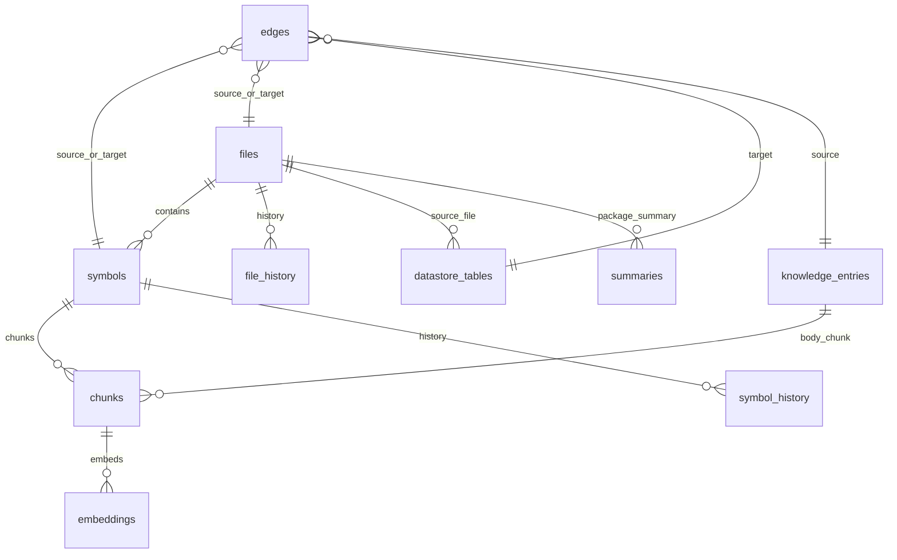
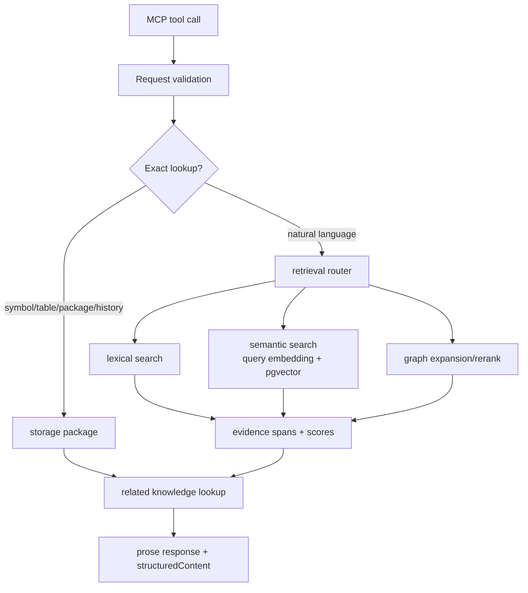
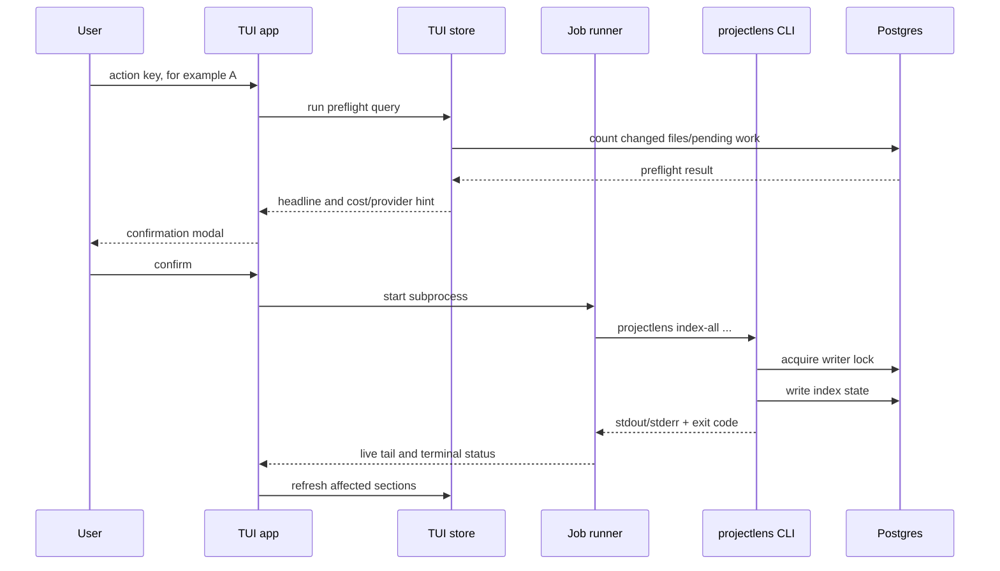

# ProjectLens Internals

Last verified against: `cmd/projectlens`, `internal/indexer`, `internal/datastore`, `internal/history`, `internal/mcpserver`, `internal/tui`, `internal/storage`, and `migrations/*.up.sql` on 2026-05-22.

This guide explains how ProjectLens works under the hood without requiring a code walk.

## Indexing Pipeline

The core code indexer turns a target Go repository into searchable records and graph edges.



### Code Stage

1. Census walks the target repo and classifies Go files.
2. The work list compares file checksums and git state so incremental runs skip unchanged files.
3. Parsing uses Go package loading and type information to extract symbols and signatures.
4. Files and symbols are written first because chunks and edges point back to them.
5. Chunks are symbol-shaped, not arbitrary token windows.
6. Graph construction emits call and implementation edges.
7. Summaries and embeddings are generated for missing work, depending on the command and provider configuration.

### Datastore Stage

`index-datastore` scans configured migration paths and SQL scan paths. It writes `datastore_tables` and emits polymorphic edges from code symbols or files to datastore tables for read/write relationships.

The table context MCP path depends on this stage: `get_table_context` reads the table record, columns, and source references through datastore edges.

### History And Coupling Stage

`index-history` walks git history inside the configured window. It writes `file_history` and `symbol_history`, then computes co-change coupling edges between files that repeatedly change in the same commits.

`get_change_history` reads the relevant history rows. `get_coupling` reads coupling from stored history-derived relationships.

### Knowledge Capture

`save_knowledge` is MCP-only write-back. It writes:

| Record | Purpose |
|---|---|
| `knowledge_entries` row | Category, title, body, tags, source, and session metadata. |
| `chunks` row with `source_type='knowledge'` | Makes the body embeddable and searchable. |
| `edges` with `edge_type='knowledge_about'` | Connects the entry to symbol, file, package, or table anchors. |

The next embedding run picks up knowledge chunks without a separate pipeline.

### Report And Export

`report` builds a read-only snapshot from storage and inspector/provider probes, then renders Markdown or JSON.

`export graph` streams a native-schema JSON graph. It can include all edge types or a comma-separated subset and can optionally include evidence blobs.

`index-backfill-provenance` is an idempotent maintenance command for databases that already had edge rows before migration 006 added edge provenance and confidence-class metadata. It updates only rows with NULL provenance and uses the fixed edge-type defaults in `cmd/projectlens/main.go`.

## Storage Model



The actual `edges` table is polymorphic. It stores `source_type`, `source_id`, `target_type`, `target_id`, `edge_type`, `properties`, `confidence`, `provenance`, and `confidence_class` instead of enforcing one foreign-key pair. That lets the same table hold calls, implements, datastore references, co-change coupling, document links, and knowledge anchors.

### Table Overview

| Table | Contents |
|---|---|
| `files` | Indexed source files, package names, checksums, classification flags, line counts, heuristic summaries, commit SHA. |
| `symbols` | Go symbols with kind, package, receiver, signature, docs, line span, checksum, SCIP symbol, and role bits. |
| `chunks` | Searchable text units for code and knowledge; `source_type` distinguishes code, knowledge, migration, docs, and future content. |
| `embeddings` | Halfvec embeddings keyed by chunk and model version. |
| `summaries` | Package summaries keyed by package name. |
| `edges` | Polymorphic graph relationships. |
| `index_runs` | Per-stage run status, commit, processed counts, timings. |
| `git_refs` | Branch to commit mapping. |
| `datastore_tables` | Tables, engines, schemas, columns, and source migration files. |
| `documents` | External document metadata/body for planned docs ingestion. |
| `symbol_history` | Commits touching symbols. |
| `file_history` | Commits touching files. |
| `knowledge_entries` | Durable lessons, conventions, how-tos, decisions, and domain notes captured by agents. |
| `index_locks` | Advisory-lock holder metadata for mutating indexer commands. |
| `schema_migrations` | Applied migration tracker created by the storage migrator. |

## MCP Query Flow



Tool behavior:

| Tool | Internal path |
|---|---|
| `find_symbol` | Symbol lexical lookup, optional kind filter. |
| `search_go_context` | Retrieval router across indexed code and available context. |
| `get_symbol_context` | Symbol lookup plus callers, callees, implementors, and related knowledge. |
| `get_package_summary` | Summary and exported symbol lookup plus related knowledge. |
| `get_table_context` | Datastore table lookup plus reader/writer edge resolution. |
| `index_status` | Index state, git state, and provider probes. |
| `get_change_history` | File or symbol history lookup. |
| `get_coupling` | Co-change file coupling lookup. |
| `save_knowledge` | Knowledge row, chunk, and anchor-edge write. |
| `search_knowledge` | Knowledge vector/metadata/anchor search. |

Handlers should return grounded prose and typed `structuredContent`; agents should prefer structured fields for automation and use prose for human display.

## TUI Job Execution



The TUI does not reimplement indexing. It shells out to the real `projectlens` binary so operational behavior matches the CLI.

## Writer Lock

All mutating indexer commands take one Postgres advisory lock with bookkeeping in `index_locks`. Read-only commands and the MCP server bypass it.

When another writer owns the lock, the command exits with code 75 and prints:

```text
another writer holds the lock: pid=<n> host=<h> cmd="<c>" started=<RFC3339>
```

Auto-recovery reaps orphaned rows when the database session behind the advisory lock is gone. `projectlens unlock --force` terminates the holder's DB backend and should be treated as an operator escape hatch, not normal flow.

## Implementation Boundaries

| Boundary | Rule |
|---|---|
| Indexer | Mutates storage and records run state; target repo remains read-only. |
| Storage | Owns SQL and schema-shaped records. Keep callers off ad hoc SQL unless there is a strong reason. |
| Retrieval | Owns query routing, lexical/semantic search, and ranking. |
| MCP server | Thin handler layer over storage/retrieval with typed responses. |
| TUI | Read status through TUI store and launch CLI subprocess jobs; do not duplicate indexer logic. |
| Agent assets | `agent/skills` are canonical; vendor-specific directories adapt wiring only. |
